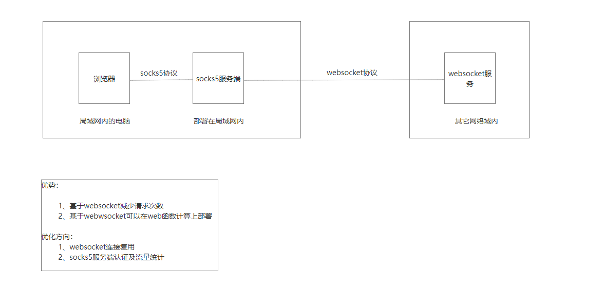
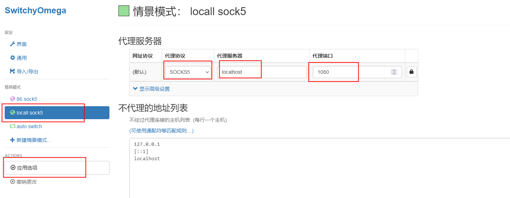

### 科学一号
- 设计
  - 
- 服务部署
  - 服务端
    - 项目打包 mvn clean package,得到jar包kexue-one-0.0.1-SNAPSHOT.jar
    - 阿里云注册账号
    - 函数计算部署
      - 打开链接 https://fcnext.console.aliyun.com/ap-northeast-1/functions
      - 确认地域
      - 创建web类型函数
      - 填写参数
        - 函数名称: 随意
        - 运行时 java17,通过文件夹上传jar包(kexue-one-0.0.1-SNAPSHOT.jar)
        - 启动命令 java -jar kexue-one-0.0.1-SNAPSHOT.jar
        - 监听端口 8080
      - 高级配置
        - cpu 0.2
        - 内存 256mb
        - 执行超时 86400
        - 单实例并发度 200
      - 点击创建
        - 创建后
          - 配额管理，并发实例数上限，设置为1
          - 配置，触发器获取公网访问地址（不用时关闭，防止被盗用），比如https://one-xxx.ap-northeast-1.fcapp.run
          - 将以上url中的host填写在application.yml中的socks.ws.server上，比如wss://one-xxx.ap-northeast-1.fcapp.run:443/ws
  - 客户端
    - 启动 com.xiaoyu.kexueone.socks.SocksServer类
- 访问
  - firefox
    - 安装扩展 Proxy SwitchyOmega
    - 配置
